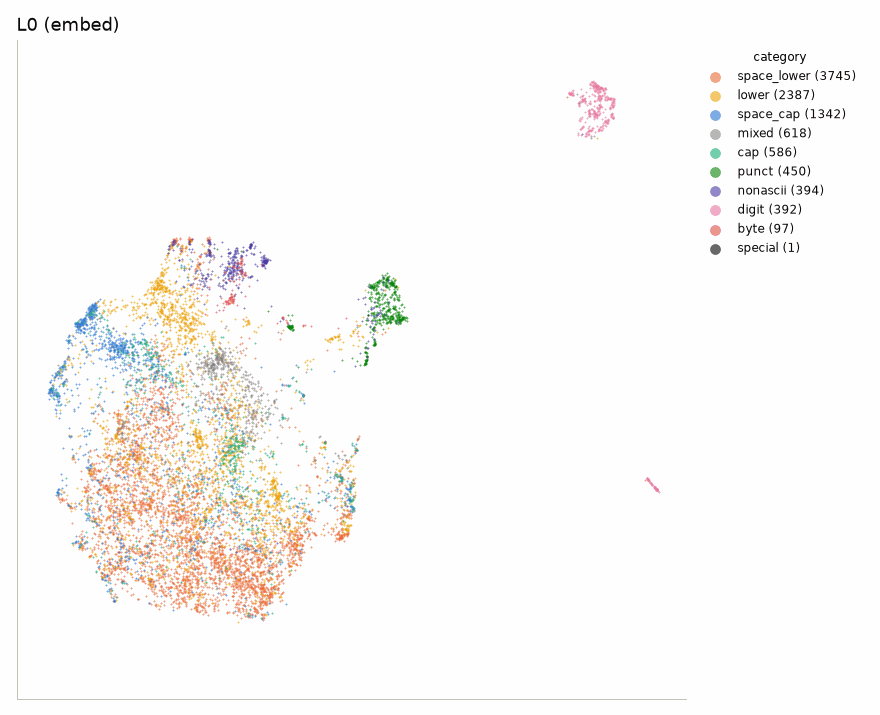
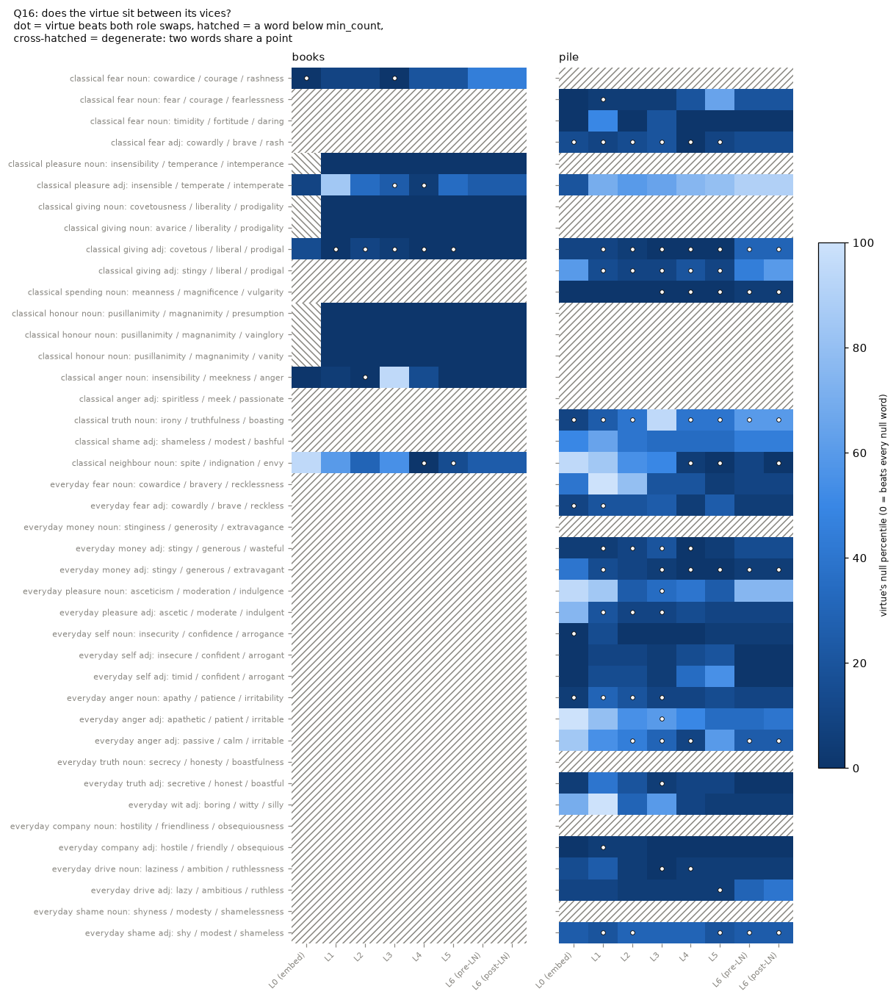
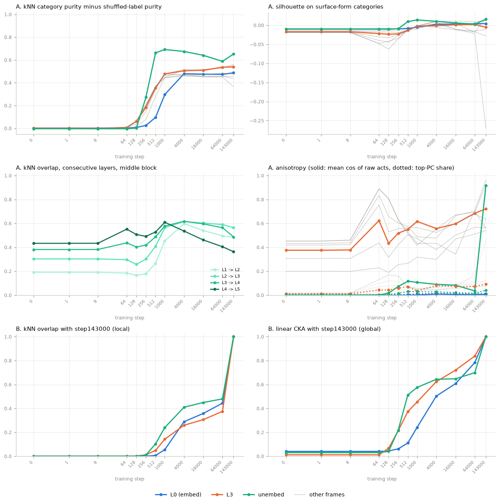
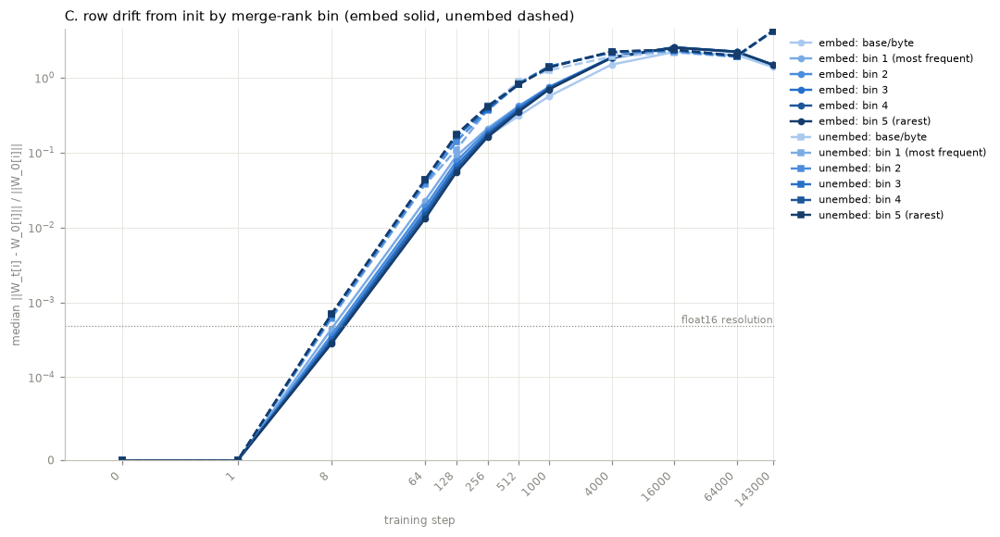

# token-drift

Push every token in `pythia-70m`'s vocabulary through the model and watch how the
vocab's cluster structure changes layer by layer. Numeric drift curves plus an
aligned-UMAP flipbook. Random-init control included so we can tell learned structure
from architectural structure.



## What this is about

A language model starts by looking up each token in a big table, the **embedding
matrix**: one vector per token, ~50k of them for Pythia. That table is a map of the
vocabulary. Tokens that end up close together are ones the model treats as similar, and
you can ask what "similar" means there: same meaning? Same spelling? Both digits? Both
starting with a space?

Each layer then rewrites those vectors (the running vector is the **residual stream**),
and at the very end a second table, the **unembedding matrix**, turns the last vector
into a score for every possible next token. So there's a map at the start and a map at
the end, but nothing in between that looks like a dictionary. This repo builds one: feed
every token through the model, take its vector at every layer, and you get a "vocab map"
per layer. Then two questions:

- **How much does the map change from one layer to the next?** We measure it by
  checking whether each token keeps the same 10 nearest neighbours (plus CKA, a
  standard whole-matrix similarity score). We also project each layer to 2D with UMAP
  (a method that squashes high-dimensional points onto a plane while trying to keep
  neighbours together). The frames are fitted jointly so you can flip through them like
  the GIF above.
- **What is the map organised by?** We label tokens by surface form (leading space,
  digit, punctuation, capitalised...) and check how often a token's neighbours share
  its label.

Everything is compared against the **same architecture with random weights**. Some
structure comes from the wiring alone and not from training, and without that control
you'd credit it to learning.

It's a small, hobby-scale mech-interp (mechanistic interpretability: reverse-engineering
what's going on inside a trained network) project, done to learn. It ran on one 8 GB GPU,
mostly on a 70M-parameter model, so read the findings as "what we saw here", not as
general laws.

### What we found, short version

- **The vocabulary map reorganises at the edges, not in the middle.** The biggest
  changes are embedding -> layer 1 and everything from layer 4 up to the unembedding.
  Layers 1-4 are a stable block. We'd predicted the opposite.
- **Surface form never goes away.** Space-prefixed vs not, digits, punctuation:
  ~70% of a token's neighbours share its category at nearly every layer (chance is
  ~23%), and the unembedding is the most surface-sorted matrix of all (88%).
- **The random-weight model isn't flat.** Its layers look more and more alike with
  depth, purely from the architecture, so "upper layers are stable" isn't automatically
  something the model learned.
- **In GPT-2 small, one LayerNorm does most of the damage.** Its final LayerNorm's
  per-coordinate gain leaves each token with only 1-2 of its 10 neighbours, in one step.
- **Real context changes less than you'd think.** Averaging each token over 15M tokens
  of real text (v1) gives roughly the same curves. So does the same text with the word
  order shuffled.
- **Virtues don't sit between their vices.** We tested Aristotle's "courage is the mean
  between cowardice and rashness" on 41 triples: mostly no, apart from a weak signal on
  classical vocabulary.
- **Training builds almost all of this in the first 1000 steps** (0.7% of training),
  checked on 12 of Pythia's public training checkpoints.

### How the repo is organised

The project grew in phases, each with its own section further down this page:

| phase | question | one token's vector is... |
|---|---|---|
| v0 | how does the vocab map change by layer? | the token alone, right after the BOS (beginning-of-sequence) token |
| v1 A | does real context change the picture? | its average over every occurrence in a Pile slice |
| v1 B | do virtues sit between their vices? | one vector per occurrence, for a list of probe words |
| v2 | when during training does the structure appear? | v0, repeated on training checkpoints |

Where to read more: the design and the predictions we wrote down before running anything
are in [`docs/EXPERIMENT.md`](docs/EXPERIMENT.md), every number is in
[`docs/FINDINGS.md`](docs/FINDINGS.md), what's still unexplained is in
[`docs/OPEN_QUESTIONS.md`](docs/OPEN_QUESTIONS.md), [`GLOSSARY.md`](GLOSSARY.md)
explains the jargon, and the papers we checked against are in [`REFERENCES.md`](REFERENCES.md). [`CLAUDE.md`](CLAUDE.md) is the working notes for the AI pair
programmer, and the most detailed description of the pipeline.

## Quickstart

```
uv sync
uv run token-drift all --config configs/pythia70m.yaml
uv run token-drift all --config configs/random_init.yaml
```

Outputs land in `runs/<run_name>/`.

v1 (corpus-averaged) runs start from text: the `corpus` stage packs a slice of
`NeelNanda/pile-10k` into 2048-token windows, then the `extract` stage averages each token's residual
over all its occurrences (~15M tokens; wants the GPU, CPU is ~10 s per batch).

```
uv run token-drift all --config configs/pythia70m_corpus.yaml
uv run token-drift all --config configs/pythia70m_corpus_shuf.yaml   # word order shuffled
uv run token-drift all --config configs/random_init_corpus.yaml
uv run token-drift compare runs/pythia70m_corpus runs/pythia70m_corpus_shuf runs/random_init_corpus -o runs/compare_v1.png
uv run token-drift v0v1 runs/pythia70m runs/pythia70m_corpus         # same tokens, v0 vs v1
```

Probe runs (milestone B) collect every hit of the probe words in 10 Gutenberg books and 3
Pile shards and keep one vector per occurrence. Read `runs/<name>/probe_corpus/count_report.md`
before the extract: that's the expensive part (Pythia ~15 min GPU and 2 GB on disk, GPT-2
~95 min and 5.4 GB).

```
uv run token-drift all --config configs/pythia70m_probe.yaml
uv run token-drift all --config configs/random_init_probe.yaml
uv run token-drift all --config configs/gpt2_probe.yaml
uv run token-drift occ --config configs/pythia70m_probe.yaml --triple cowardice,courage,rashness
```

Checkpoint runs (v2) repeat the v0 pipeline on Pythia's training checkpoints (Hub branches
`step0` .. `step143000`, listed under `revisions:` in the config), one step folder each, then
compare them in `runs/<name>/timeline/`. A rerun only does the revisions that aren't finished,
so adding one to the list later costs one checkpoint (~1 min on the GPU).

```
uv run token-drift all --config configs/pythia70m_ckpt.yaml          # ~45 min incl. flipbooks
uv run token-drift timeline --config configs/pythia70m_ckpt.yaml --skip-flipbooks   # replot in ~1 min
uv run python scripts/v2_sanity.py
```

## Results (v0, context-free `[BOS, tok]`, first run 2026-09-16)


| layer 0 (input embedding) | unembedding matrix |
|---|---|
|  |  |

Flipbook: [`docs/results/pythia70m_flipbook.gif`](docs/results/pythia70m_flipbook.gif).
CKA heatmap: [`docs/results/pythia70m_cka.png`](docs/results/pythia70m_cka.png).
Random-init layer 0 for comparison: [`docs/results/random_init_L0.png`](docs/results/random_init_L0.png)
(a featureless blob, as it should be).

**What we saw, in three sentences.** Surface form is baked in at layer 0 (digits and
punctuation are islands, space-prefix vs not is the big split) and it *never fades*:
72% of a token's 10 nearest neighbours share its category at layer 0, ~70% in the
middle, and 88% in the unembedding, which is the most surface-form-organised matrix
of the lot. Reorganisation happens at the edges, not the middle: embed -> L1 (kNN
overlap 0.36), then everything from L4 up (L4 -> L5 0.36, block 6 0.24, final LN 0.29,
unembed 0.13), while the middle layers L1–L4 are a stable block (CKA 0.8–0.9,
overlap ~0.5). The random-init control is flat noise on every
category metric, but its consecutive-layer overlap *rises* with depth (0.06 -> 0.48),
so "the upper layers look stable" is partly the architecture talking, not learning.

**Predictions from `docs/EXPERIMENT.md` vs reality.**

- *"Layer 0: clear clusters by category."* Yes in the UMAP and in kNN purity. But
  silhouette on the categories is ~0.005 at every layer, indistinguishable from
  shuffled labels. Silhouette wants compact convex clusters and these are ribbons in
  512-d; kNN purity is the number to look at. (Added as a metric after the first run.)
- *"Middle layers: the biggest consecutive-layer drop."* Wrong. L1–L4 are the *most*
  stable stretch (overlap 0.48–0.56). The drops sit at the edges: embed -> L1 (0.36), and
  from L4 on it gets steadily rougher: L4->L5 0.36, block 6 0.24, final LN 0.29,
  unembed 0.13.
- *"Surface-form silhouette falls in later layers."* Can't tell from silhouette (~0
  everywhere, see above), so we used kNN purity instead. It does fall: 0.79 at L1 to
  0.67 at L5 (0.59 at L6 pre-LN, but that frame is scrambled by our normalization, see
  "Does the normalization change the story?" below). The final hidden state stays low (0.68). The *unembedding matrix*,
  though, is the most surface-form-sorted thing in the model (0.88). Plausible reason:
  in a context-free pass the model's best guess about "what comes next" is mostly
  "what kind of token is this".
- *"`the`/`a`/`an` might cluster at the end."* They do; their labels land on top of
  each other in `trajectories.png`.
- *"Control: every consecutive-layer overlap high."* Wrong. A random first layer
  scrambles neighbourhoods almost completely (0.06), then each further random layer
  perturbs the accumulated residual proportionally less, so overlap climbs with depth.
  The trained L6 state and the unembed have nothing in common with each other in the
  control (overlap 0.001), while in the trained model L0 is *closer* to the unembed
  (0.22) than L6 is (0.14). That last one is worth a closer look.

## Checked against the literature

Local copies of the papers live in `papers/` (gitignored). Only the two required
references are checked here; Cheng et al. and Viswanathan et al. are v1 material.

### Ethayarajh (2019): anisotropy. Reproduces.

His headline for GPT-2: random word pairs have mean cosine ~0.6 in layers 2–8, rising
to almost 1.0 at layer 12. Ours (bottom-left panel above, computed on the *raw*
activations before centering):

| | L0 | L1–L5 | L6 (post-LN) | unembed |
|---|---|---|---|---|
| pythia-70m | 0.01 | 0.54–0.72 | 0.96 | 0.92 |
| random init | 0.00 | 0.19–0.41 | 0.43 | 0.00 |

Same shape, same near-1.0 final layer. Three things his paper didn't have:

- **Layer 0 is isotropic here.** Pythia uses rotary position, so `hidden_states[0]` is the
  bare embedding. GPT-2's layer 0 has a learned positional embedding added, which is
  why his curve starts at 0.6 instead of 0.
- **The random-init control is anisotropic too, and it grows with depth.** He calls
  anisotropy "inherent to, or a by-product of, contextualization". The control says a
  chunk of it is architectural. In our `[BOS, tok]` setup there's an obvious mechanism:
  position 1 attends to BOS, the BOS value is the same vector for every token, and the
  residual stream accumulates it. Partly a v0 artefact; v1 will tell.
- **The final LayerNorm is violent.** Mean row norm goes 14 (L5) -> 438 (L6), and the top
  PC explains 45% of L6's centered variance vs 11% at L5 (the triangle line in the
  anisotropy panel). That's a massive-activation dimension,
  and it's where `drop_top_pcs` would bite. The unembed's 0.92 turns out to be a mean
  offset rather than a variance direction (top PC only 5%), so centering handles it.

His other measures (self-similarity across contexts, intra-sentence similarity,
maximum explainable variance) need multiple contexts per word: v1.

### Voita, Sennrich & Titov (2019): bottom-up evolution. Mostly needs v1.

- *LM representations lose information about the current token with depth and build
  information about the next token.* **Untestable in v0 by construction**: with
  `[BOS, tok]` input every layer is a function of the token alone, so identity is never
  lost. Our purity curve is the coarse version of "identity retained" and it doesn't
  fade. This is the strongest argument for the corpus-averaged v1.
- *Change between consecutive layers is non-monotonic for LMs, with a spike at the top
  (their fig. 3b).* Partial echo: our change is high at L4->L5 and at L6->unembed, but
  our biggest jump is L0->L1, which they don't see. Different measure (PWCCA vs kNN
  Jaccard), different data (contextual vs context-free). Don't over-read.
- *Frequent tokens change more per layer, and the effect fades at the top (their
  fig. 4b).* **Does not reproduce** (bottom-right panel). Frequency here is BPE merge
  rank, which for both tokenizers is exactly token-id order. Across the five merged-token
  quantile bins the per-layer change differs by at most 0.03 and, if anything, rarer
  tokens change slightly *more*. Informative rather than disappointing: their effect
  comes from frequent tokens receiving more contextual updating, and there is no
  context here. The one bin that stands out is base/byte tokens (bin 0), which change
  *less* through L1–L4: those are the digits and punctuation that sit in tight islands.
- *Tokens with similar next-token distributions merge in upper LM layers (their
  "is/are/was/were" t-SNE).* Same phenomenon as our `" the"`/`" a"`/`" an"` convergence
  at the unembed.

## GPT-2 small, first look


| layer 0 (wte + wpe[1]) | L12 pre final-LN (hook) | L12 post final-LN |
|---|---|---|
|  |  |  |

Flipbook: [`docs/results/gpt2_flipbook.gif`](docs/results/gpt2_flipbook.gif). The L12
frame is a hollow ring: after centering, a representation dominated by one huge shared
direction leaves the tokens on a shell around it. Surface form is still visible on the
ring (purity 0.63), just smeared. The pre-LN frame next to it is an ordinary layer:
the ring is made by the LN.

`configs/gpt2.yaml`. Tied embeddings, so the unembed frame *is* layer 0 again: kNN
overlap 0.999 and CKA 1.00 between them, which is the sanity check passing, not a
finding. What is a finding:

- **The middle is a plateau, the top is a cliff.** Consecutive-layer overlap sits at
  0.68–0.78 from L1 all the way to L10, then L11->L12 collapses to 0.08 (CKA 0.37).
  Pythia's worst consecutive step was 0.36. Hooking the pre-LN residual (2026-09-24)
  says it's the final LayerNorm, specifically its gain: block 12 alone keeps 0.40 of
  neighbours, the LN gain then drops it to 0.09. Details in FINDINGS section 8.
- **Ethayarajh's GPT-2 anisotropy curve, reproduced almost point for point.** 0.72 at
  L0 (that's the added positional embedding; the bare `wte` alone is 0.27, see the
  unembed point), dipping to ~0.6 through L4–L7, then climbing to 0.98 at L12. His
  figure 1 shows 0.6 flat through layers 2–8 and ~0.98 at 12.
- **Surface form again never fades** (purity 0.63–0.77 everywhere vs 0.25 shuffled),
  and base/byte tokens again change far less per layer than merged tokens, with no
  difference between frequency quantiles among the merged ones.

**Timing.** extract 18 s on an RTX 5060, metrics ~30 s, AlignedUMAP on 10k tokens x 8
frames **48 minutes** when two runs share the CPU, 19 minutes for GPT-2's 14 frames
running alone. (Re-runs on 2026-09-24 were much faster: 6 min for Pythia's 9 frames,
12 min for GPT-2's 15. Not sure why; nothing in `viz.py` changed.) The flipbook is the whole budget; `viz.method: stacked_umap` is the fast
knob if you want a quick loop.

## Does the normalization change the story? (Q2, 2026-09-24)

Two variants of the normalize stage, for both trained models: `drop_top_pcs: 2`
(remove the two biggest shared directions after centering) and `row_norm_first: true`
(scale every row to length 1 *before* centering, roughly what the model's own
LayerNorm does). Configs `configs/*_drop2.yaml`, `configs/*_rownorm.yaml`.

| pythia-70m | gpt-2 |
|---|---|
|  |  |

The middle-layer plateau and GPT-2's final-LN cliff survive both variants. Pythia's dip
at L5 -> L6 pre-LN doesn't: under either variant it's an ordinary step (0.24 -> 0.46),
so that one was our pipeline, not the model. Each variant has a cost, though: dropping
PCs takes surface-form signal out of GPT-2's middle layers, and normalizing rows first
breaks the exact removal of a shared offset. Numbers in FINDINGS section 9.

Dropping the top two PCs also fills in GPT-2's hollow L12 ring: underneath it there's an
ordinary surface-form map ([`docs/results/gpt2_drop2_L12.png`](docs/results/gpt2_drop2_L12.png)).

## Results (v1 milestone A, corpus-averaged, 2026-10-03)

Instead of "the token alone after BOS", each token's vector is now its residual averaged
over every occurrence in 15M tokens of the Pile (tokens seen < 20 times are dropped,
39,887 remain). Controls: the same corpus with tokens shuffled inside each window (same
counts, no word order), and random init. Full write-up with all the numbers: FINDINGS
section 11.


How many of a token's 10 neighbours v0 and v1 agree on, per layer (Jaccard). The dip at
L6 pre-LN is our center-then-unit-norm order, not the model (FINDINGS 11.3); unit-norm
first, that point is 0.22, level with L6 post-LN. The unembed is the same matrix in both, so 1.0 there is trivially true.

**What we saw, in three sentences.** Real context changes the *shape* of the story very
little: surface form still never fades (purity 0.73 at L0, 0.69-0.85 in between, 0.89 at
the unembed), the embedding's neighbourhoods fade at about the v0 pace (~6 of 10 kept at
L1, ~3 at L5), and, surprisingly, a corpus with the word order shuffled gives nearly the same curves,
only separating on self-similarity from L3 on and on anisotropy at L4-L5. v0's deep layers
are only half-trustworthy: v0 and v1 share ~0.5 Jaccard of neighbours at L1 and ~0.2 at the
top, which is still ~+0.1 above the random-init control, reasonably faithful for digits,
punctuation and whole words and close to meaningless for word fragments like `ing`. Three
loose ends from v0 got tied up: the last hidden state and the unembed disagree because they
encode opposite bigram neighbourhoods (last state ~ what *follows* a token, unembed ~ what
*precedes* it), Voita's frequency effect doesn't reproduce on either a local or a global
metric, and the "final LayerNorm barely moves v1" surprise was our normalization order
again.

What's still open, and what milestone B (per-occurrence vectors) inherits: `docs/OPEN_QUESTIONS.md`.

## Results (v1 milestone B, do virtues sit between their vices? 2026-10-04)

Aristotle says a virtue is a mean between two vices (courage between cowardice and
rashness). Milestone B checks whether Pythia-70m's representations agree: per-occurrence
vectors for 41 deficiency / virtue / excess triples, pulled from 10 moral-philosophy books
and 3 Pile shards, each triple scored against frequency-matched null words and with the
vices swapped into the middle. Full write-up: FINDINGS section 12.



Dark = the virtue sits closer to its vices' segment than the null words; dot = it also beats
both vices in the middle position. Hatched = a word with fewer than 20 occurrences in that
group. The solid dark book rows (temperance, liberality, magnanimity) are a tokenizer
artefact: words sharing their last token piece stay glued together at every layer.

**What we saw, in three sentences.** Mostly no: the virtue is the middle word more often than
chance only for the classical vocabulary in the Pile (6 of 10 triples at layers 4-5 vs 1 for
random weights, about the 90th percentile of random draws), not for everyday words, and the
books have too few clean triples to say. Geometrically the three words form near-random
triangles rather than lines (the trained model's are only a bit flatter than chance), and
there's no shared "too little -> too much" direction across virtues. The bigger lessons were
about method: words sharing a token piece are unusable under the last-piece convention, and
one random-init run is not a control, since 20 random seeds give anywhere from 2 to 11 of 18
triples "passing".

**GPT-2 follow-up (parked).** Same probe on GPT-2 small: there the virtue is almost never
the middle word, and for everyday words the two vices tend to be the closest pair, as if
good vs bad mattered more than too little vs too much. Too few triples to claim it, so it's
parked with its numbers as OPEN_QUESTIONS Q21. Two things we'd assumed turned out wrong:
GPT-2's tokenizer splits temper|ance and friends exactly like Pythia's, and 5 of the 10
books are in PG-19, so Pythia may have read them in training.

## Results (v2, training checkpoints, 2026-10-04)

The v0 pipeline on 12 Pythia-70m checkpoints, log-spaced from step 0 to the finished model at
step 143000, to see *when* the structure in the results above shows up. Full write-up:
FINDINGS section 13.





**What we saw, in three sentences.** Almost everything arrives in the first 1000 steps (0.7% of
training): surface-form clustering is half there by step 512 in L3 and the unembed and by 1000
in the embedding, which is the *last* frame to get it, and the stable middle block is half-built
by 512, peaks at 4000 and then loosens for the rest of training. Unembed rows move about twice
as fast as embed rows early, as predicted, but the embed's rare tokens barely lag (we'd
predicted they'd fall far behind; Adam is the suspect), and 214 tokens never move at all except
by weight decay, because the tokenizer can never produce them. Late in training a single shared
vector grows in every unembed row, in a direction softmax can't even see; that one is open
(OPEN_QUESTIONS Q22).
